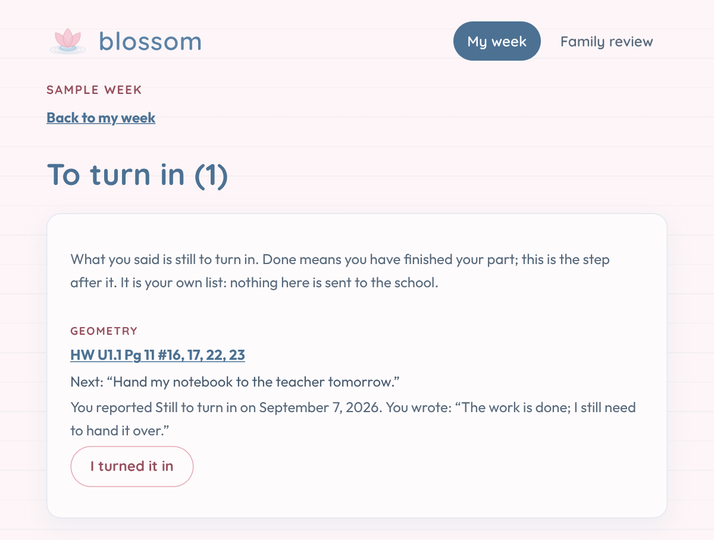

<p align="center">
  
</p>

<h1 align="center">Blossom</h1>

<p align="center">
  A planning assistant to help a student make sense of schoolwork and deadlines.
</p>

<p align="center">
  <a href="https://github.com/gbodegas/blossom/actions/workflows/ci.yml"></a>
  
  <a href="LICENSE"></a>
</p>

## Why this exists

Blossom is a homework and deadline tracker I am building for my teenage
daughter. She named it.

I want it to help her see what is coming, make room for the work, and ask for
help before an evening becomes a scramble. Her parents are collaborators.
She should end up with her own way of planning, with support she can
understand and choose to use.

The information we have is often thin: a title, a date, and perhaps a note
to check a textbook. Sometimes the dates disagree. Blossom keeps those
differences visible and helps plan with the information available. Setting
aside time for an assignment does not mean it knows how long finishing it
will take.

I intend to define what success looks like with her rather than on her behalf.

## What works today

Blossom is still an early project, built around our household. A parent adds
assignments by hand or pastes text from the school. It doesn't connect to the
school platform or read our email.

**My week.** She can see what's due this week, where each date came from, and
work assigned this week but due later. Missing dates and disagreements stay
visible, so she can see what still needs checking.

**Add assignments.** Paste the school's homework page, weekly summary, or
"Missing" email, or add an assignment by hand. Blossom shows what it found
before anything is saved. Pasting the same work again doesn't create
duplicates, and dates that disagree keep their sources. I built this around
our school's formats; anything it can't read is left for us to check.

**Plan today.** She can ask for an evening plan, with time set aside for work
and a reason for each choice. Blossom checks the plan and can ask for up to
two revisions. The saved plan opens on her page, with links to the work and
any concerns the review couldn't resolve. If she later says something is
Done, she can see which block to skip; the saved times stay as they were.
A parent can look it over, but she doesn't have to wait to get started.

<p align="center">
  
</p>

*The screenshots use made-up schoolwork. This plan and its review were
prepared for the example, without a live model call. She has marked one
assignment Done, so that block now says she can skip it.*

**Too much right now.** One press asks for a shorter evening of work. There
is no rating to fill in and no explanation to give. She chooses when to make
that plan and can change her mind.

**Her own update.** She can say Done or Not yet, leave a note, and change or
undo her answer later. Done means she has finished her part. Blossom leaves
it out of new plans while keeping the school's report separate.

**Turning it in.** Finishing the work doesn't always mean it made it to the
teacher. She can keep a **To turn in** list with a next step for each item,
even after she says Done. That work stays visible across weeks. She can mark
it turned in and undo that choice too.

<p align="center">
  
</p>

*An example of finished work with one step left: handing it in.*

**Homework notes.** Not every assignment makes it into the portal. She can
jot down something she heard in class or from a classmate, in her own words.
A class and date are optional. She can edit it, put it away, or ask for help.
Her parents can read it but can't change it. A note stays a note, and out of
every plan, until she or a parent adds it to homework.

**Add it to homework.** From a note, she can open a form that shows her words
and asks for the class, a title, and optionally a due date, a kind, and a
note about the work; a parent can do the same from Family review. Nothing is
guessed from what she wrote. **Save details** keeps those on the note;
**Add to homework** makes the assignment, once, and keeps the note as
evidence on it. Anything a parent fills in is marked as theirs. If homework
with that class and title is already here, Blossom lists it with its date and
what she and the school currently say about it, and asks whether this is the
same homework or a separate assignment. It doesn't merge on its own. From
then on the assignment goes to the planner like any other; her original words
still don't. A school paste that names such homework waits, whole, until
Blossom can ask whether it's the same work. That question, and searching for
homework to join a note to, aren't built yet.

**Family review.** If she asks for help, a parent can reply and mark the
request resolved. If she says Done but the school says Missing, we can see
both accounts and check together. A parent can record that we checked
without changing what either side said. Refresh the pages to see the latest
updates.

<p align="center">
  
</p>

*A request for help and something to check together, with her account and
the school's side by side.*

**Household sign-in.** She and her parents can use separate passphrases to
open their pages. You can leave these unset while trying Blossom on your own
computer. The [development guide](docs/development.md#running-for-the-household)
walks through setting it up for the family's devices.

Texting, reminders, and a connection to the family calendar aren't built
yet. Blossom doesn't contact the school or submit work. The
[architecture notes](docs/architecture.md) go into the design and its limits.

## Try it locally

You can try the sample without a school account or an API key. It gives you
a week of made-up assignments to browse, update, and ask for help with.
Making a new plan is optional and needs an Anthropic API key.

You'll need Git and Python 3.12 or 3.13. I've put the Python and pip
instructions first so uv isn't another thing you need to install. If you
already use uv, there's a shorter setup below.

These steps are for Windows PowerShell. The
[development guide](docs/development.md#when-uv-cannot-download) covers macOS
and Linux. Choose a local folder that isn't synced by OneDrive or a similar
service.

**Get the code once.** In PowerShell:

```powershell
git clone https://github.com/gbodegas/blossom.git
cd blossom
```

If you already have the code, open PowerShell in your Blossom folder and
start with the next step.

**Install once.** From the repository folder:

```powershell
py -3.12 -m venv .venv
.\.venv\Scripts\python.exe -m ensurepip --upgrade
.\.venv\Scripts\python.exe -m pip install -e .
```

Use `py -3.13` in the first line if Python 3.13 is installed instead. If your
installation has no `py` launcher, use `python -m venv .venv` after checking
that `python --version` says 3.12 or 3.13. You don't need to activate the
environment or change PowerShell's execution policy. The `ensurepip` line
makes sure pip is available, including if an earlier uv attempt left it out.

**Start the sample.** From the Blossom folder, paste this whole block. Use
it again whenever you want to start the app:

```powershell
$settingsFile = if (Test-Path .env) { ".env" } else { ".env.example" }

Get-Content $settingsFile, data\sample\sample.env |
    Where-Object { $_ -match '^\s*[A-Za-z_][A-Za-z0-9_]*=' } |
    ForEach-Object {
        $setting, $value = $_ -split '=', 2
        Set-Item -Path "Env:$($setting.Trim())" -Value $value.Trim()
    }

.\.venv\Scripts\python.exe -m uvicorn blossom.app:app --reload
```

This uses your own `.env` settings if you've made that file, or `.env.example`
if you haven't. It then loads the sample week and keeps anything you change
under `.local/sample/`. A key or passphrases you've added to `.env` work here
too. If you edit either settings file, use `KEY=value` without quotes around
the value.

Open [My week](http://127.0.0.1:8000/student/due-this-week) or
[Family review](http://127.0.0.1:8000/parent). Both pages say "Sample week".
The date stays at September 7, 2026, so the example still makes sense
whenever you try it. You'll see two active assignments due that week, one
under "Reported done", and a reading log due the following week. There
isn't a saved plan on your first visit; the screenshot shows a prepared
example.

Leave PowerShell open while using Blossom, and press **Ctrl+C** to stop it.
Your sample updates will still be there when you come back. To start fresh,
see [resetting the sample](docs/development.md#the-sample-week). If something
doesn't work, the [troubleshooting notes](docs/development.md#troubleshooting)
are a good place to start.

<details>
<summary>Already use uv? The shorter setup works too.</summary>

From the repository folder:

```bash
uv sync
uv run --env-file .env.example --env-file data/sample/sample.env uvicorn blossom.app:app --reload
```

Use `--env-file .env` in place of `--env-file .env.example` if you have your
own settings. Keep the sample file last. The
[uv installation page](https://docs.astral.sh/uv/getting-started/installation/)
covers installing uv if you want it.

</details>

## Using the planner

To try **Plan today**, add an Anthropic API key. This makes paid requests
when you ask for a plan. Stop Blossom with **Ctrl+C**, then run this in
PowerShell to create your settings file if needed and open it:

```powershell
if (-not (Test-Path .env)) {
    Copy-Item .env.example .env
}

notepad .env
```

Set `ANTHROPIC_API_KEY` to your key, save the file, and repeat the **Start the
sample** block above. Blossom will pick up the new settings when it starts.
"Plan today" will appear on her page. If you use uv, launch with `.env` in
place of `.env.example` as described above.

When she asks for a plan, Blossom sends the unfinished assignments and their
date sources, her Not yet updates and notes on that work, any supplied
household rules and system notes, and whether she has said the evening is
too much. Her homework notes and her reports about turning work in stay out
of those requests; a note she has added to homework goes in as the assignment
it became, never as her words. Later calls also include the proposed plan and
feedback on it. Making a plan can take one to six model calls. If there's
nothing left to schedule, it makes none. A parent's review doesn't call the
model.

Blossom saves the full prompts and responses locally. The
[development guide](docs/development.md) explains where they live, how long
they're kept, and the settings you can change. The
[architecture notes](docs/architecture.md) cover the checks and their limits.

## Contributing

Bug fixes, tests, accessibility improvements, and small engineering changes
are welcome. Blossom is built for one household. Please discuss larger
features in an issue first.

Use synthetic data only. Fixtures live in `data/sample/` and
`data/synthetic/`; never include real student or family data. New third-party
imports need a justification in the project's allowlist.

Run the same checks as CI. If you installed with pip, the
[development guide](docs/development.md#when-uv-cannot-download) gives the
steps to install the tools and run those checks.

```bash
uv run ruff check .
uv run ruff format --check .
uv run mypy blossom tests
uv run pytest
```

If you are considering something similar for your own family, the part I
would carry over is the habit of asking, for every capability, whether the
person it is built for would consent to it existing.

## License

[MIT](LICENSE).
