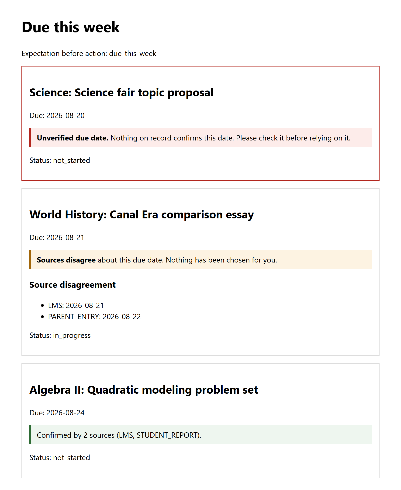

<p align="center">
  
</p>

<h1 align="center">Blossom</h1>

<p align="center">
  A planning assistant for a student whose deadlines don't agree with each other.
</p>

---

## Why this exists

Blossom is a homework and deadline tracker I am building for my thirteen year
old daughter. She named it.

Her deadlines come from too many places. The school platform says one thing,
an email notification says something slightly different, I remember a third
version, and she has her own account of it. Every planner I have seen picks
one of those and presents it as the truth. When it picks wrong, she is the one
who pays for it.

Blossom does not pick. When the sources agree, it says so. When they disagree,
it shows her every claim and who made it, and leaves the decision with her.
When nothing confirms a date at all, it says that too, instead of quietly
showing the date anyway.

The second thing it is for is the days when everything is too much. A student
in the middle of executive dysfunction does not have the capacity to open an
app and rate her overwhelm on a scale from one to ten. Blossom will have a
single control that means "too much right now", as frictionless as squeezing a
stress ball, and it will treat that signal as true the moment it arrives.

## What makes it different

- **It cannot send anything.** Everything Blossom writes stops in a draft that
  a person reads and sends by hand. This is not a rule the agent follows. There
  is no send tool for it to call. A rule can be argued around under a
  plausible-sounding situation. A tool that was never built cannot be called.
- **It shows disagreement instead of hiding it.** Reconciling sources that
  conflict is the core of the system, not an error path. Every due date on
  screen carries a label saying how well it is corroborated, including the
  ones nothing corroborates.
- **It never studies her.** The agent reflects on its own performance, such
  as learning that its reminders land badly at a certain hour. It is
  structurally unable to write a reflection about her.
- **Three people, three views.** She sees her week. A parent sees a checkpoint
  summary rather than a live feed. A verifier sits between anything the agent
  writes and anything that leaves the system. Their interests genuinely
  conflict, and the design keeps that conflict visible instead of resolving it
  silently.
- **It says what it expects before it looks.** Before every tool call, the
  agent states what it expects to get back. That is what turns a surprising
  result into a noticed contradiction rather than a confidently wrong answer.

## What it looks like today

<p align="center">
  
</p>

The weekly view is real, end to end. The fixture assignments load, their
sources are reconciled, and each one is labeled with how well its due date is
corroborated. One is unverified, one has two sources a day apart, and one is
confirmed by two sources. Nothing is filtered out, including the assignment
nothing corroborates.

## Status

Blossom is early, and it is built for one household. No model is called yet,
so there is no agent to talk to. What runs today is the student's weekly view,
the source reconciliation behind it, and the guardrails that will constrain
the agent when it arrives: the missing send tool, the reflection boundary,
and a tool registry that cannot hold anything that reports having sent
something.

The "too much" signal is accepted and not yet acted on. The semantic half of
retrieval is a stub. Nothing is stored between runs.
[docs/architecture.md](docs/architecture.md) lists every gap between the
design and the code.

I do not have a success metric yet. Success looks like the agent making her
own tracking legible to her rather than replacing it, and I intend to define
what that means with her rather than on her behalf.

## Install

Blossom needs Python 3.12 or 3.13 and [uv](https://docs.astral.sh/uv/). If you
do not have a matching Python, uv downloads one on its own.

**Windows** (PowerShell)

```powershell
powershell -ExecutionPolicy ByPass -c "irm https://astral.sh/uv/install.ps1 | iex"
```

**macOS and Linux**

```bash
curl -LsSf https://astral.sh/uv/install.sh | sh
```

Open a new terminal after installing so `uv` is on your path. Then, on any
platform:

```bash
git clone https://github.com/gbodegas/blossom.git
cd blossom
uv sync --dev
```

That creates `.venv` inside the repository and installs the pinned
dependencies from `uv.lock`. No API key and no school platform access are
needed. Everything runs against the synthetic fixtures in `data/synthetic/`.

## Getting started

The fixtures carry due dates in the week of August 19, 2026, and "due this
week" is computed from the real clock, so on any other week the page is
legitimately empty. Pin the clock to that week to see them.

The easiest way works the same everywhere. Copy `.env.example` to `.env`,
which already pins the clock, and start the app with that file:

```bash
cp .env.example .env
uv run --env-file .env uvicorn blossom.app:app --reload
```

On Windows, `cp` works in PowerShell. In cmd, use `copy` instead.

Then open <http://127.0.0.1:8000/student/due-this-week>.

Other things to look at while it runs:

- <http://127.0.0.1:8000/parent/checkpoint> is the parent's view: a summary
  of status and conflicts, not a live feed. JSON for now.
- <http://127.0.0.1:8000/verifier/claims> is the verifier's view: each factual
  claim, the policy it was checked against, and the result. JSON for now.
- <http://127.0.0.1:8000/docs> is the interactive API page, where you can
  send the "too much" signal by posting to `/student/workload-signals` with no
  body. Today it is acknowledged and discarded.

If you would rather pin the clock without a `.env` file, the syntax depends on
your shell.

PowerShell:

```powershell
$env:BLOSSOM_TODAY = "2026-08-19"
uv run uvicorn blossom.app:app --reload
```

macOS and Linux:

```bash
BLOSSOM_TODAY=2026-08-19 uv run uvicorn blossom.app:app --reload
```

Every path the app uses is configurable through the `BLOSSOM_*` variables in
`.env.example`, and all of them have working defaults.

To run the same checks CI runs:

```bash
uv run ruff check .
uv run mypy blossom tests
uv run pytest
```

## Troubleshooting

**The weekly page is empty.** The clock is not pinned, so "this week" is the
real week and the fixtures fall outside it. Start the app with `--env-file
.env` or set `BLOSSOM_TODAY` as shown above.

**`uv sync` fails with `HandshakeFailure` or a TLS error.** Your network only
allows an internal package proxy. `uv` downloads from PyPI directly, while
`pip` honors your proxy configuration. Build the environment with pip
instead. If `uv sync` already created `.venv` before failing, reuse it:

```bash
.venv\Scripts\python -m ensurepip
.venv\Scripts\python -m pip install -e .
.venv\Scripts\python -m pip install mypy==1.17.1 ruff==0.12.9 pytest==8.4.1 httpx2==2.10.0
```

On macOS and Linux the path is `.venv/bin/python`. If there is no `.venv` yet,
create one first with `python -m venv .venv` using a Python 3.12 or 3.13
interpreter. Then run the app with `.venv\Scripts\python -m uvicorn
blossom.app:app --reload` instead of `uv run`. Keep the version pins matching
`pyproject.toml`; a test checks that they do.

**`uv` is not recognized after installing.** Open a new terminal. The
installer updates your path for new shells only. If that does not help,
`pip install uv` works too.

**Windows: `BLOSSOM_TODAY=2026-08-19 uv run ...` says the command is not
recognized.** That is bash syntax. Use the PowerShell form above, or the
`.env` file.

**Port 8000 is already in use.** Add `--port 8765` (or any free port) to the
uvicorn command and open that port instead.

**The editor says `fastapi` or `pydantic` cannot be found.** The editor is
using a different interpreter than the one in `.venv`. In VS Code, run
**Python: Select Interpreter** from the command palette and pick the one
under `.venv`.

**mypy or ruff in the editor disagrees with CI.** The editor is running the
copy bundled with its extension rather than the pinned one. The repository's
`.vscode/settings.json` points both extensions at the versions in `.venv`, so
selecting that interpreter fixes it.

## A note on data

No real family data belongs in this repository, and none is checked in.
Everything in `data/synthetic/` describes a fictional student. The
accommodations corpus is held as operational support rules rather than
clinical descriptions, a decision made for privacy reasons that turned out to
serve retrieval as well, since an instruction is a self contained unit of
meaning and a clinical description is not.

If you are reading this because you are considering something similar for
your own family, the part I would carry over is not the architecture. It is
the habit of asking, for every capability, whether the person it is built for
would consent to it existing.

## How it works

[docs/architecture.md](docs/architecture.md) describes what the code does
today: the three view models, the ways the missing send path is enforced,
how sources are reconciled, how retrieval routes between structured and
semantic stores, and where the code still falls short of the design. The
design notes behind those decisions are kept outside this repository.

## License

[MIT](LICENSE).
