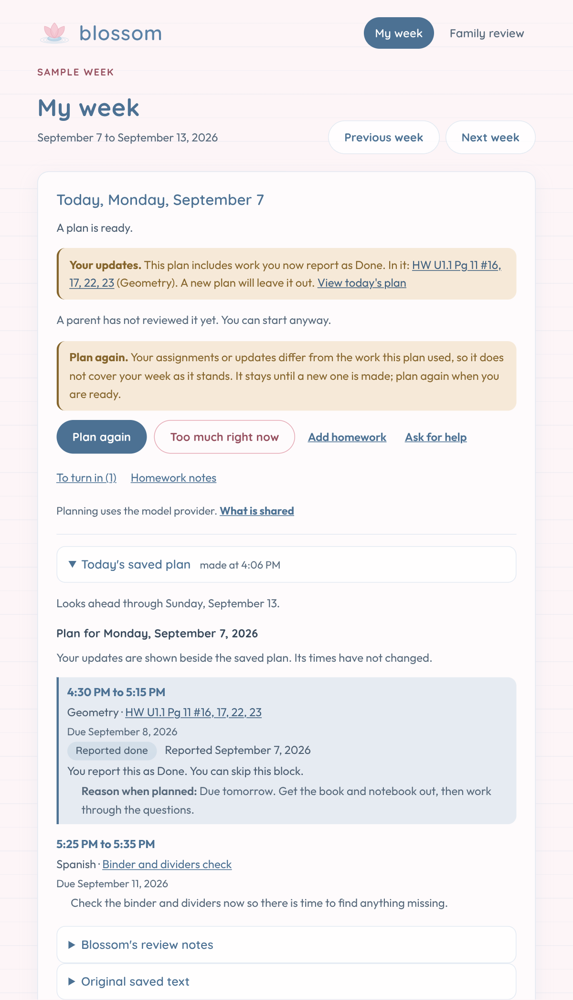
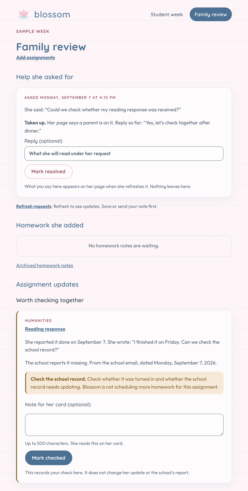

<p align="center">
  
</p>

<h1 align="center">Blossom</h1>

<p align="center">
  A planning assistant to help a student make sense of schoolwork and deadlines.
</p>

<p align="center">
  <a href="https://github.com/gbodegas/blossom/actions/workflows/ci.yml"></a>
  
  <a href="LICENSE"></a>
</p>

## Why this exists

Blossom is a homework and deadline tracker I am building for my teenage
daughter. She named it.

I want it to help her see what is coming, make room for the work, and ask for
help before an evening becomes a scramble. Her parents are collaborators.
She should end up with her own way of planning, with support she can
understand and choose to use.

The information we have is often thin: a title, a date, and perhaps a note
to check a textbook. Sometimes the dates disagree. Blossom keeps those
differences visible and helps plan with the information available. Setting
aside time for an assignment does not mean it knows how long finishing it
will take.

I intend to define what success looks like with her rather than on her behalf.

## What works today

Blossom is an early project for one household. The app currently reads bundled
synthetic records; it does not import assignments from a live school platform
or email account.

**My week.** Browse the school week, see due dates and their sources, and keep
work assigned this week but due later in sight. Missing dates stay visible;
disagreements are marked without quietly replacing the recorded date.

**Plan today.** Ask for an evening plan with time set aside for work and a
reason for each choice. Blossom checks and reviews the proposal, with up to
two revisions. The plan is available immediately, including any unresolved
review concerns. A parent can review it without blocking her from using it.

<p align="center">
  
</p>

*A synthetic sample week with a prepared plan. Open "View today's plan" to
read the time set aside for the evening.*

**Too much right now.** One press, with no rating or explanation required.
It sets the shorter budget for the next plan and offers "Make a smaller
plan". The existing plan stays unchanged until she requests another one.
She can take the signal back.

**Ask for help.** Send a request to the family review page, with an optional
note. A parent can respond and mark it resolved. Refresh either page to see
updates; opening the parent's page does not count as a response.

<p align="center">
  
</p>

*A synthetic help request and reply. Family review puts help she asked for first.*

Blossom does not contact the school or submit work. A **household sign-in**
guards the pages when two passphrases are set, hers and a parent's: hers opens
her week, a parent's opens both pages, and a device stays signed in for a
month. With neither set the pages are open, which is right for trying it on
your own machine and nowhere else. The
[architecture notes](docs/architecture.md) describe the design and what is
still unimplemented.

## Try it locally

You need Git, Python 3.12 or 3.13, and
[uv](https://docs.astral.sh/uv/getting-started/installation/). Browsing the
sample week and trying the help flow need no API key or school account.
Generating a plan needs an Anthropic key; the screenshot above shows a
prepared scenario.

```bash
git clone https://github.com/gbodegas/blossom.git
cd blossom
uv sync --dev
uv run --env-file .env.example --env-file data/sample/sample.env uvicorn blossom.app:app --reload
```

Open [My week](http://127.0.0.1:8000/student/due-this-week) or
[Family review](http://127.0.0.1:8000/parent). The sample is pinned to September
7, 2026: three assignments are due that week, and a reading log is assigned
that week but due the next. Both pages say "Sample week".

The sample's saved state stays under `.local/sample/`. The launch files also
set an example household time zone and the normal and shorter evening
budgets. The [development guide](docs/development.md#the-sample-week) covers
these settings, the separate fixtures with conflicting dates, resetting the
demo, and a clearly labeled written plan for showing the idea without a key.
It also covers installation troubleshooting and the pip fallback.

## Using the planner

Planning is optional and makes paid requests to Anthropic. Copy `.env.example`
to `.env`, put your key in `ANTHROPIC_API_KEY`, and load it instead of the
example file. Keep the sample file last to continue using synthetic data:

```bash
uv run --env-file .env --env-file data/sample/sample.env uvicorn blossom.app:app --reload
```

Press "Plan today" on her page. Requests include assignments and date sources,
household rules, the planner's notes about earlier plans, and whether she has
said the evening is too much. Later calls also include the proposed plan and
feedback on it. A run makes one to six model calls. Approving a plan makes
no additional model request.

Local traces retain complete prompts and answers. The
[development guide](docs/development.md) explains storage, retention, and
configuration; the [architecture notes](docs/architecture.md) describe the
checks and their limits.

## Contributing

Bug fixes, tests, accessibility improvements, and small engineering changes
are welcome. Blossom is built for one household. Please discuss larger
features in an issue first.

Use synthetic data only. Fixtures live in `data/sample/` and
`data/synthetic/`; never include real student or family data. New third-party
imports need a justification in the project's allowlist.

Run the same checks as CI:

```bash
uv run ruff check .
uv run ruff format --check .
uv run mypy blossom tests
uv run pytest
```

If you are considering something similar for your own family, the part I
would carry over is the habit of asking, for every capability, whether the
person it is built for would consent to it existing.

## License

[MIT](LICENSE).
