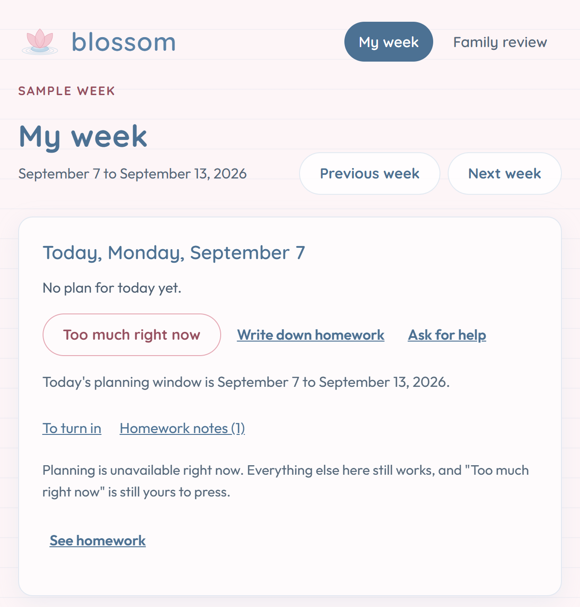
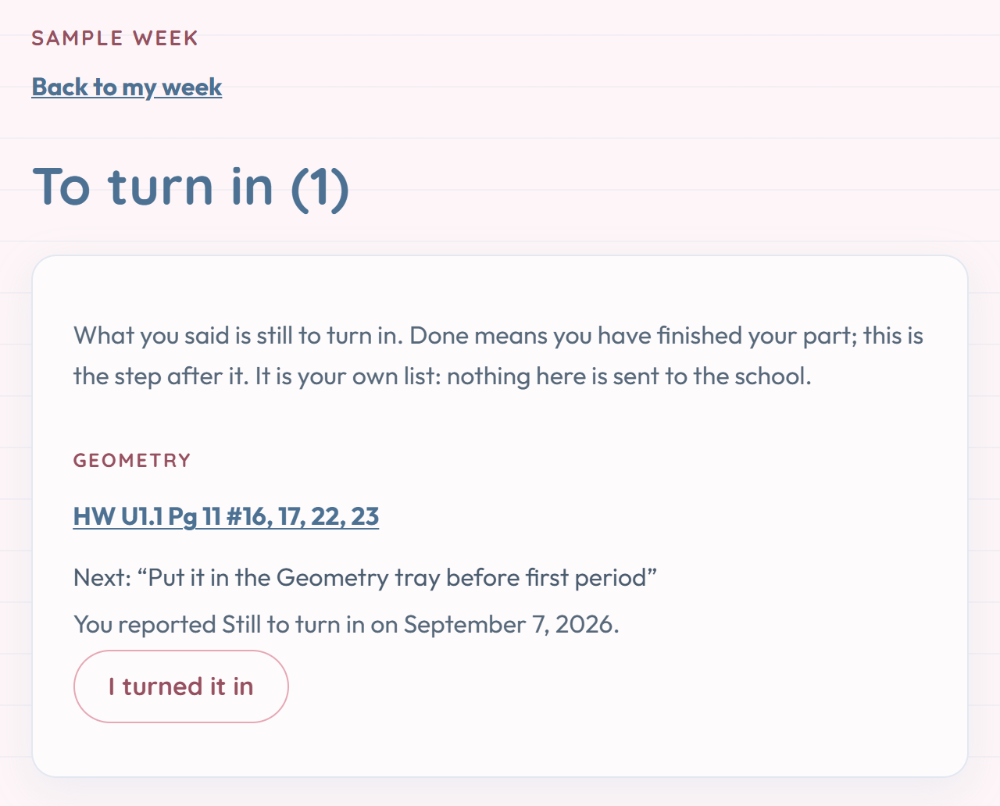

<p align="center">
  
</p>

<h1 align="center">Blossom</h1>

<p align="center">
  A planning assistant to help a student make sense of schoolwork and deadlines.
</p>

<p align="center">
  <a href="https://github.com/gbodegas/blossom/actions/workflows/ci.yml"></a>
  
  <a href="LICENSE"></a>
</p>

[Try the sample](#try-it-locally) · [What works today](#what-works-today) ·
[Technical details](docs/architecture.md)

## Why this exists

Blossom is a homework and deadline tracker I am building for my teenage
daughter. She named it.

I want it to help her see what is coming, make room for the work, and ask for
help before an evening becomes a scramble. Her parents are collaborators.
She should end up with her own way of planning, with support she can
understand and choose to use.

The information we have is often thin: a title, a date, and perhaps a note
to check a textbook. Sometimes the dates disagree. Blossom keeps those
differences visible and helps plan with the information available. Setting
aside time for an assignment does not mean it knows how long finishing it
will take.

I intend to define what success looks like with her rather than on her behalf.

## What works today

Blossom is still an early project, built around our household.

**My week.** She can see deadlines, school instructions, and work assigned
this week but due later. Missing dates and disagreements stay visible.

**Homework notes.** She can **Write down homework** now and add the class
and date later. It can stay a note, become an assignment, or link to
homework already here. Her original words stay separate from the
assignment details.

**Finishing and turning it in.** She can say Done or Not yet and change
her answer. Done means she finished her part. A separate **To turn in**
list keeps her next step visible across weeks. Neither update confirms
that the school received the work.

**Plan today.** She can ask for an evening plan with time set aside for
work. **Too much right now** asks for a shorter plan when she next makes
one. A parent's review does not stop her getting started.

**Working together.** Parents can review plans, answer requests for help,
and check differences between her account and the school's. They can
enter assignments or paste school text for review before saving. The
reader is built around our school's formats.

Blossom doesn't connect to the school platform, read email, submit work,
or send reminders. Planning needs an API key; the other features work
without one.

<p align="center">
  <a href="docs/assets/student-week.png"></a>
</p>

*My week in the made-up sample. No API key or saved plan.*

<p align="center">
  <a href="docs/assets/to-turn-in.png"></a>
</p>

*Finished work with one step left before handing it in.*

## Try it locally

You can try the sample without a school account or an API key. You'll need
Git and Python 3.12 or 3.13.

These steps are for Windows PowerShell with Python and pip. For uv, macOS,
or Linux, see [other ways to start the sample](docs/development.md#other-ways-to-start-the-sample).
Choose a local folder that isn't synced by OneDrive or a similar service.

**Get the code once.** In PowerShell:

```powershell
git clone https://github.com/gbodegas/blossom.git
cd blossom
```

**Install once.** From the Blossom folder:

```powershell
py -3.12 -m venv .venv
.\.venv\Scripts\python.exe -m ensurepip --upgrade
.\.venv\Scripts\python.exe -m pip install -e .
```

Use `py -3.13` in the first line if that's the version you have. If there's
no `py` launcher, use [the guide's fallback](docs/development.md#other-ways-to-start-the-sample)
for that line. You don't need to activate the environment or change
PowerShell's execution policy.

**Start the sample.** From the Blossom folder, paste this whole block. Use
it again whenever you want to start the app:

```powershell
$settingsFile = if (Test-Path .env) { ".env" } else { ".env.example" }

Get-Content $settingsFile, data\sample\sample.env |
    Where-Object { $_ -match '^\s*[A-Za-z_][A-Za-z0-9_]*=' } |
    ForEach-Object {
        $setting, $value = $_ -split '=', 2
        Set-Item -Path "Env:$($setting.Trim())" -Value $value.Trim()
    }

.\.venv\Scripts\python.exe -m uvicorn blossom.app:app --reload
```

It reads your `.env` if you've made one, or `.env.example` if not, then
the sample settings last. Blossom doesn't load `.env` on its own. If you edit either settings file, use `KEY=value` without
quotes around the value. Your sample changes stay under `.local/sample/`
until you [reset the sample](docs/development.md#the-sample-week).

Open [My week](http://127.0.0.1:8000/student/due-this-week) or
[Family review](http://127.0.0.1:8000/parent). The sample uses made-up
schoolwork and stays at September 7, 2026. There is no saved plan at first,
and **Plan today** appears only after adding an API key.

Without a key, you can still write down homework, record a Done update,
add an item to **To turn in**, or ask for help. The
[sample guide](docs/development.md#the-sample-week) walks through those steps.

Leave PowerShell open while using Blossom, and press **Ctrl+C** to stop it.

For your own schoolwork, follow the
[household setup guide](docs/development.md#running-for-the-household).
It covers separate records, the real date, student and parent sign-in,
and access on the home network. Open a fresh terminal when switching from
the sample.

## Using the planner

To try **Plan today**, add an Anthropic API key. This makes paid requests
when you ask for a plan. Stop Blossom with **Ctrl+C**, then run this in
PowerShell to create your settings file if needed and open it:

```powershell
if (-not (Test-Path .env)) {
    Copy-Item .env.example .env
}

notepad .env
```

Set `ANTHROPIC_API_KEY` to your key, save the file, and repeat the **Start the
sample** block above. "Plan today" will appear on her page.

Planning sends Anthropic the assignments and school instructions in the
planning window, assignment notes, her Not yet updates, household rules,
and planning context. That can include her separate **Note about the work**;
the original **Homework notes** text and history stay out of the requests.
Her help requests and hand-in reports stay out too.

One planning attempt can make up to six model calls, or none if there is
nothing to schedule. Prompts and responses are also saved locally; model
processing still happens at Anthropic. The
[development guide](docs/development.md) explains exactly what is shared,
what is stored, and how long it is kept.

The app is written in Python. FastAPI serves the pages, SQLite keeps the
local records, and LangGraph runs planning. Code checks the proposed plan
before a separate model call reviews it. See the
[architecture notes](docs/architecture.md) for the workflow and its limits.

## Contributing

Bug fixes, tests, accessibility improvements, and small engineering changes
are welcome. Blossom is built for one household. Please discuss larger
features in an issue first.

Use synthetic data only. Fixtures live in `data/sample/` and
`data/synthetic/`; never include real student or family data. New third-party
imports need a justification in the project's allowlist.

Run the same checks as CI. If you installed with pip, the
[development guide](docs/development.md#when-uv-cannot-download) gives the
steps to install the tools and run those checks.

```bash
uv run ruff check .
uv run ruff format --check .
uv run mypy blossom tests
uv run pytest
```

If you are considering something similar for your own family, the part I
would carry over is the habit of asking, for every capability, whether the
person it is built for would consent to it existing.

## License

Blossom is free software under the GNU Affero General Public License v3.0 or
later; see [LICENSE](LICENSE). The license asks anyone who runs a modified
version for other people over a network to offer those people its source. The
link in every page's footer is where Blossom does that, so a modified copy
points `SOURCE_URL` in `blossom/templating.py` at its own source.

The Outfit and Quicksand fonts in `blossom/static/fonts/` stay under the SIL
Open Font License 1.1, with their license texts beside them.
